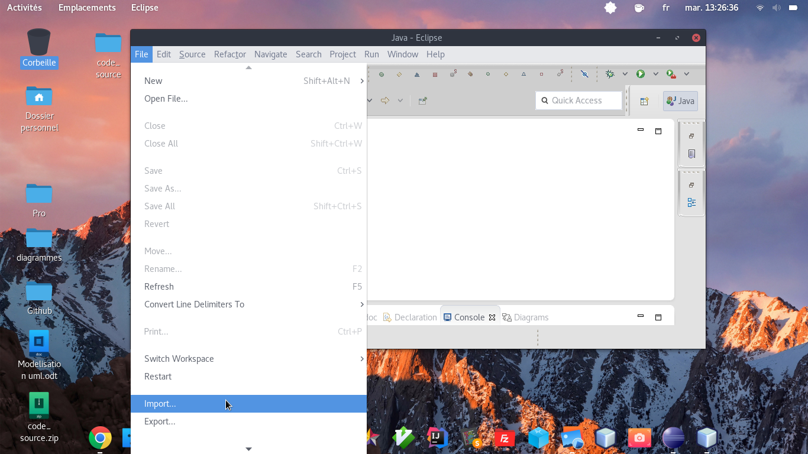
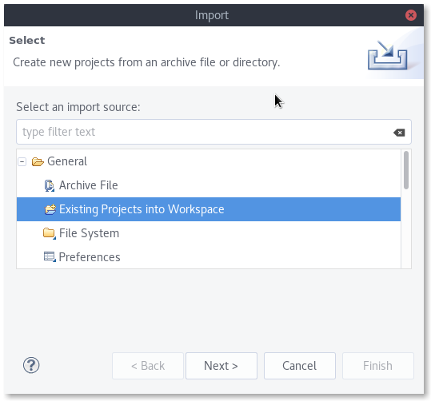
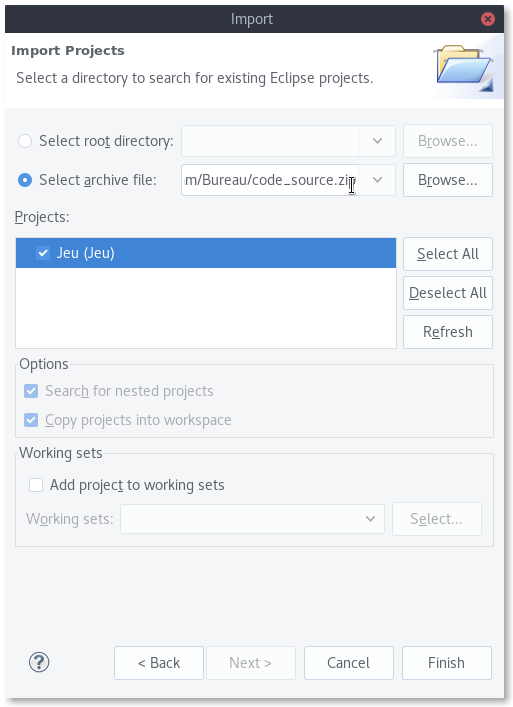
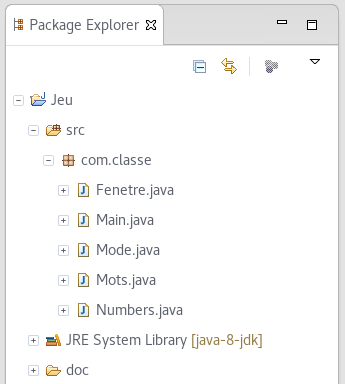

# Projet JAVA
## Groupe 5 (Nombre et Mot Magique)
**Membres du projet:**
- Laurent Panek
- Abdessamad Douhi
- Abdessalam Benharira
- Branis Lamrani
## Chef de projet:
- Branis Lamrani
## Encadré par:
- Juliana Bod
- Urbain Nzouda
- Gauthier De Backer
## Récuperer le projet fourni
1. Téléchargez le fichier [code_source.zip](https://github.com/Laurent-PANEK/projet_JAVA/tree/master/Code_Source)

2. Dézipper le fichier si nécessaire

3. Dans Eclipse, créez un nouveau projet 

4. 

5. 

6. 

